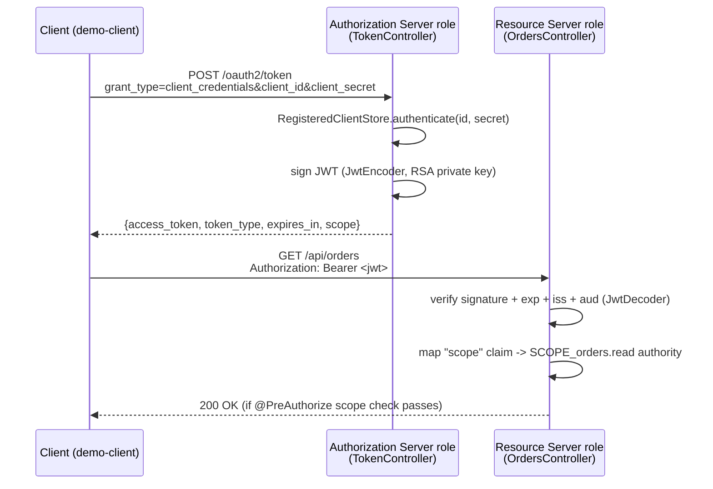

# OAuth2, and how this module implements it

This document has three parts:

1. **The concept** — what OAuth2 actually is, its roles, tokens, and grant types.
2. **The implementation** — how this module's code maps onto those concepts.
3. **The review** — a line-by-line production-readiness pass: what's hardened, and what's still missing before this could be called a real authorization server.

---

## 1. What OAuth2 is

OAuth2 (RFC 6749) is an **authorization** framework: it lets one piece of software (a *client*) act on a resource on behalf of someone or something else, with a scoped, time-limited credential, without ever handling the resource owner's actual password. It answers "is this request allowed to do X?" — not "who is this person?" (that's OpenID Connect, a thin identity layer built on top of OAuth2, out of scope here).

### The four roles

| Role | What it is | In a login-with-Google example |
|---|---|---|
| **Resource Owner** | Whoever/whatever owns the protected data | The end user |
| **Client** | The application requesting access | Your web app |
| **Authorization Server (AS)** | Issues tokens after authenticating the client (and, for user-facing grants, the resource owner) | Google's OAuth endpoint |
| **Resource Server (RS)** | Hosts the protected API, accepts the token as proof of authorization | Google's People API |

For machine-to-machine auth (no human in the loop), the resource owner disappears and the client authenticates *as itself* — that's the **client_credentials** grant this module implements.

### Tokens

- **Access token** — the credential presented to the resource server, normally as an `Authorization: Bearer <token>` header. Short-lived (minutes, not days).
- **Refresh token** — a longer-lived credential used to get a new access token without redoing the full flow. Not applicable to `client_credentials`: the client already holds its own long-lived secret, so it just re-authenticates instead.
- **ID token** (OIDC only) — asserts *who the user is*; irrelevant here since there's no user.

Access tokens come in two shapes:
- **Opaque** — a random string; the resource server can't read anything from it and must call back to the AS (*introspection*, RFC 7662) to find out what it means.
- **Self-contained (JWT)** — a signed JSON payload the resource server can verify and read locally, with zero calls back to the AS. This module issues JWTs.

A JWT is three base64url segments — `header.payload.signature` — where the payload carries public claims:

| Claim | Meaning |
|---|---|
| `iss` | who issued this token (must match what the RS expects) |
| `sub` | who/what the token is about (here, the client_id) |
| `aud` | who the token is *for* — the RS must reject tokens meant for someone else |
| `exp` / `iat` | expiry / issued-at, as epoch seconds |
| `jti` | unique token ID, for audit trails and (with extra infrastructure) revocation |
| `scope` | space-separated permissions granted |

Signing (not encrypting) a JWT means anyone can *read* it, but only the holder of the private key can *mint* a valid one — the resource server verifies the signature against the issuer's **public** key, published as a **JWK Set** (RFC 7517), typically at a well-known URL.

### Grant types (ways to get a token)

| Grant | Use case | Involves a user? |
|---|---|---|
| **Authorization Code** (+ PKCE) | Web/mobile app login | Yes |
| **Client Credentials** | Service-to-service API calls | No — this module |
| **Refresh Token** | Silently renew an access token | N/A once granted |
| **Device Code** | TVs, CLIs — no browser to redirect to | Yes, on a second device |
| ~~Implicit~~ / ~~Resource Owner Password~~ | Legacy, formally deprecated in OAuth 2.1 | — |

### The properties that make this secure

- **Scopes** narrow what a token can do (`orders.read` vs `orders.write`) — least privilege, not "all or nothing."
- **Signature verification** stops forged tokens.
- **Expiry validation** bounds the blast radius of a leaked token.
- **Issuer/audience validation** stops a token minted for *service A* being replayed against *service B*, even if both trust the same signing key.
- **Client authentication** (a secret, or better, mTLS) stops anyone from impersonating a registered client at the token endpoint.
- **TLS everywhere** — none of the above matters if the token is sent over plaintext HTTP.

---

## 2. How this module implements it

This module deliberately plays **both** the Authorization Server and Resource Server roles in one process, so the entire grant can be exercised without standing up Keycloak/Okta/a second service. In a real deployment these would be two independently-deployed, independently-scaled systems that only share a public key (see the [gaps](#4-honest-gaps-what-a-real-deployment-still-needs) below).

### Class-by-class

| Class | Role it plays | Concept it embodies |
|---|---|---|
| `DemoClientsProperties` | Config binding (`demo.oauth2.*`) | Client registry + issuer/audience/TTL, externalized per environment |
| `RegisteredClientStore` | Client authentication | Verifies `client_id`/`client_secret`; secrets are BCrypt-hashed at startup, never compared or stored in plain text |
| `JwtConfig` | AS signing key + RS verification key | Generates the RSA key pair, exposes `JwtEncoder` (signs) and `JwtDecoder` (verifies signature + timestamps + issuer + audience) |
| `AudienceValidator` | RS token validation | The custom "is this token for me" check Spring Security deliberately leaves to the application |
| `TokenController` | AS token endpoint | `POST /oauth2/token` — RFC 6749 §4.4 client_credentials grant, RFC 6749 §5.1/§5.2 response/error shapes |
| `JwkSetController` | AS key publication | `GET /oauth2/jwks` — RFC 7517 JWK Set, so a real, separately-deployed resource server could validate tokens independently |
| `SecurityConfig` | RS request pipeline | Stateless JWT bearer auth (`oauth2ResourceServer().jwt(...)`), scope claim → `SCOPE_*` authority mapping |
| `OrdersController` | Protected API | `@PreAuthorize("hasAuthority('SCOPE_orders.read')")` — scope-based authorization on the actual resource |
| `TokenEndpointExceptionHandler` | AS error handling | Normalizes failures to RFC 6749 §5.2 `{"error": "...", "error_description": "..."}` |

### Where the client_credentials grant is *implemented* vs. *observed*

- **Client authentication** (`RegisteredClientStore.authenticate`) is genuinely how it works in production: a hash comparison, run in constant-ish time regardless of whether the `client_id` exists (see [review](#3-production-readiness-review) below).
- **Token issuance** (`TokenController`) mints a real RS256-signed JWT with the standard claim set — no shortcuts.
- **Token validation** (`JwtConfig` + `SecurityConfig`) is Spring Security's actual resource-server machinery, the same code path a completely separate microservice would use if pointed at this service's `/oauth2/jwks`.

---

## 3. Production-readiness review

This is the outcome of a real pass over the code, not a checklist run for show. Each row is a finding that existed in the original version of this module; the "Fix" column is what's in the code now.

| # | Concern | Risk if left alone | Fix applied |
|---|---|---|---|
| 1 | `JwtDecoder` only checked signature + `exp`/`nbf` | Any correctly-signed token would be accepted regardless of `iss`/`aud` — a token minted for a different audience (if the key were ever shared or reused) would silently pass | Added `JwtIssuerValidator` + custom `AudienceValidator`, composed via `DelegatingOAuth2TokenValidator` |
| 2 | Client lookup short-circuited on unknown `client_id` (skipped the BCrypt call entirely) | Response timing leaks which `client_id`s are registered, narrowing brute-force/enumeration attempts | `RegisteredClientStore.authenticate` always runs `passwordEncoder.matches(...)`, against a precomputed dummy hash when the client doesn't exist |
| 3 | Missing required token-request params (e.g. no `client_id`) fell through to Spring's generic error body | Inconsistent, non-RFC-shaped error responses; harder for real OAuth2 clients to parse | Added a `MissingServletRequestParameterException` handler returning `{"error":"invalid_request", ...}` |
| 4 | `/actuator/health` was permitted in `SecurityConfig` but the actuator dependency didn't exist — a dead, misleading security rule | Operational blind spot: no liveness/readiness signal for orchestrators (k8s, ECS, ...) | Added `spring-boot-starter-actuator`, exposed `health` only, `show-details: never` so it's safe to leave unauthenticated |
| 5 | No way for a separately-deployed resource server to validate these tokens | The whole "AS and RS are really two systems" story only worked because they shared a JVM | Added `GET /oauth2/jwks`, serving `rsaKey.toPublicJWK()` — a real, standards-shaped JWK Set endpoint |
| 6 | Issuer/audience were hardcoded Java constants | Can't run the same artifact in two environments (staging/prod) with correct, distinct issuer URLs | Moved to `demo.oauth2.issuer` / `demo.oauth2.audience`, both overridable via `DEMO_OAUTH2_ISSUER` / `DEMO_OAUTH2_AUDIENCE` env vars |
| 7 | Client secrets were literal values in `application.yml` | Real secrets should never be committed to version control | Secrets now read via `${ENV_VAR:default}` — the plaintext defaults remain only so the demo runs with zero setup |
| 8 | Issued tokens had no `jti` | No stable identifier to correlate a token across audit logs, or to key a future revocation denylist | Added `.id(UUID.randomUUID().toString())` to the claims set |

A few things reviewed and found **already correct**, worth calling out so they don't look like oversights:
- Secrets are BCrypt-hashed before being held in memory, and the plain-text config value is never retained — `RegisteredClient` only stores the hash.
- The JWKS endpoint returns `rsaKey.toPublicJWK()`, not the `RSAKey` bean itself — serializing the bean directly would leak the private key.
- CSRF is correctly disabled (this is a stateless bearer-token API, not a cookie/session-based one — CSRF protection doesn't apply and would only add friction).
- Method-level `@PreAuthorize` scope checks are on the actual write path (`POST /api/orders`), not just the URL — no scope-check bypass via an unmapped verb.

---

## 4. Honest gaps: what a real deployment still needs

This module is a correct, idiomatic reference implementation of the protocol mechanics. It is **not** a drop-in production authorization server. The gaps below are real, and deliberately not papered over:

- **Signing key is ephemeral and per-instance.** `JwtConfig` generates a fresh RSA key pair on every startup. Restarting the process invalidates every outstanding token. Running two instances behind a load balancer is actively broken today: each instance has a different key and a different `/oauth2/jwks`, so a token minted by instance A won't validate wherever instance B (or a resource server pinned to instance B's JWKS) checks it. **This is the single biggest blocker to calling this production-ready as-is.** Fixing it means loading a persistent key (file, KMS, or HSM-backed) shared across instances, plus a rotation policy that publishes the old key alongside the new one in the JWKS for the outgoing token's remaining lifetime.
- **Client registry is static YAML, not a database.** No way to add/revoke/rotate a client's secret without a redeploy, and no audit trail of who changed what.
- **No rate limiting or brute-force protection** on `/oauth2/token`. A real deployment needs request throttling (per-`client_id` and per-IP) and alerting on repeated `invalid_client` responses.
- **No revocation.** JWTs are stateless by design — once issued, this token is valid until `exp` regardless of anything that happens afterward. A real system that needs "kill this token now" (e.g. a compromised client) needs either short TTLs plus a denylist keyed on `jti`, or a switch to opaque tokens with introspection (RFC 7662).
- **No centralized secret management.** Env-var overrides are a step up from hardcoded YAML, but a real deployment should source client secrets from a vault/KMS, not process environment variables.
- **Hand-rolled authorization server.** This module intentionally implements the AS role itself, for teaching. A production system should generally use a maintained product (Keycloak, Okta, Auth0, or Spring Authorization Server) rather than a hand-rolled token endpoint — the OAuth2/OIDC spec surface is large, and subtle deviations are a common source of real vulnerabilities.
- **No mTLS or DPoP.** Bearer tokens are usable by anyone who has them; sender-constrained tokens (mTLS-bound certificates, or DPoP proof-of-possession) prevent a stolen token from being replayed elsewhere.
- **No structured audit logging / metrics** on token issuance, failures, or scope denials — needed for real incident response.
- **TLS termination is out of scope of this module** and must be provided by the deployment environment; this must never run over plaintext HTTP in production.

None of this changes the grade of the *protocol implementation* — it changes the grade of the *deployment* around it. The code in this module does the OAuth2 mechanics correctly and defensively; the gaps above are operational/infrastructure maturity, and are exactly what you'd staff a real rollout of this module to close before go-live.
